<div align="center">

# 🧞 Game Save Genie

**Steam Cloud for the games that don't have it.**

Automatic, versioned, self-hosted cloud save sync for PC games — Hydra and manual installs, GOG offline installers, repacks, anything a launcher isn't protecting. Your saves, your cloud, no subscription.

[](https://github.com/Vasanthdev2004/Game-Save-Genie/actions/workflows/ci.yml)
[](LICENSE)
[](pyproject.toml)



</div>

## Why this exists

If you play games outside Steam/Epic/Xbox, **nothing is protecting your saves**. One corrupted file, one Windows reinstall, one "wait, which PC did I play on last?" and dozens of hours are gone. Paid save-sync services cap your history at a couple of backups and delete everything when you stop paying.

Game Save Genie runs quietly in the background and gives you what the launchers give their games:

- 🕹️ **Knows 19,000+ games** — save locations detected via the open-source [Ludusavi](https://github.com/mtkennerly/ludusavi) database, plus process watching to know when you're playing
- 💾 **Backs up automatically** — when a game closes, and every 10 minutes while it runs
- 🕰️ **Every session is a version** — immutable, checksummed snapshots; roll back to any point with `gsg restore --version`
- ☁️ **Your own cloud** — Google Drive (free 15 GB), OneDrive, any S3 bucket, or [anything rclone speaks](https://rclone.org/overview/); retention is enforced so it never fills up
- 🖥️ **Follows you between PCs** — `gsg pull` restores on any machine, remapping paths saved under a different Windows username
- 🔒 **Paranoid by design** — downloads are verified before anything is touched, a safety backup is taken before every restore, restores never run while the game is, and a strictly-newer rule means offline progress is never clobbered

Steam/Epic/Xbox games are detected and skipped automatically — those launchers already sync their own saves.

## Get started in 30 seconds

**Standalone (no Python):** grab `gsg.exe` from [Releases](https://github.com/Vasanthdev2004/Game-Save-Genie/releases).
**From source** (Python 3.10+): `pip install git+https://github.com/Vasanthdev2004/Game-Save-Genie`

Then:

```bash
gsg
```

That's the whole setup. A wizard finds your games, connects your cloud (Google Drive/OneDrive open a browser — sign in, click Allow, done), and offers start-at-boot. From then on `gsg auto` protects everything, hands-free. Ludusavi and rclone are downloaded automatically on first use.

## How it compares

|  | Game Save Genie | Ludusavi | Game Backup Monitor | Hydra Cloud | Syncthing DIY |
|---|:-:|:-:|:-:|:-:|:-:|
| Auto-backup on game close | ✅ | ❌ | ✅ | ✅ | ➖ folder sync only |
| Periodic backup during play | ✅ | ❌ | ✅ | ❌ | ➖ |
| Automatic cloud restore | ✅ | ❌ manual | ❌ | ❌ | ➖ no game awareness |
| Cross-machine path remapping | ✅ | ❌ | ❌ | ✅ | ❌ |
| Version history | ✅ per session | ✅ | ✅ | ⚠️ 2 per game | ❌ conflict files |
| Storage you own | ✅ | ✅ | ⚠️ sync folder | ❌ their servers | ✅ |
| Free | ✅ | ✅ | ✅ | ❌ subscription* | ✅ |

<sub>*Hydra Cloud saves are deleted 7 days after a subscription ends. Comparison reflects mid-2026; check each project for current features. Ludusavi is a fantastic backup engine — Game Save Genie builds on it and adds the automation layer.</sub>

## Everyday commands

```bash
gsg auto                  # the only command most people need — watch + backup + restore
gsg auto --install        # start hidden at logon (per-user, no admin needed)

gsg status                # per-game overview, storage meter, quota warning
gsg scan                  # what's installed (--source all to include Steam/Epic/Xbox)
gsg add "Elden Ring" --exe eldenring.exe    # track something manually

gsg backup [game-id]      # back up now (--dry-run previews, changes nothing)
gsg versions <game-id>    # local history      gsg cloud-list <game-id>  # cloud history
gsg restore <game-id> [--version ID]         # roll back to any local snapshot
gsg pull <game-id> [--version ID]            # restore from the cloud (any machine)
gsg pull --all            # catch this machine up on everything that's behind

gsg pause / resume <game-id>   # exclude/re-include a game
gsg remove <game-id> [--purge] # untrack (--purge deletes local + cloud saves)
```

## Playing on two machines

Run the same setup (same cloud account) on both PCs. Each machine backs itself up; newer cloud saves are pulled down at startup and while a game isn't running. `gsg pull --all` catches a machine up on demand.

The trust rules that make this safe:

1. **Verify first** — downloads are integrity-checked and staged before anything on disk changes; a bad download changes nothing.
2. **Safety backup always** — your current saves are snapshotted before every restore, and the restore aborts if that fails.
3. **Strictly newer only** — a restore only happens when the cloud is ahead of everything this machine has seen. Played offline? Your progress wins and uploads on next close.
4. **Never under a live game** — if you're playing, you get a notification instead of a mid-session overwrite.
5. **Usernames remapped** — saves recorded under `C:\Users\alice\...` restore correctly for `bob`, both in Ludusavi's manifest and the backed-up file tree.

## Configuration

`gsg config` shows everything; config lives at `%APPDATA%\game-save-genie\Game Save Genie\config.yaml` (Windows) or `~/.config/Game Save Genie/` (Linux).

| Key | Default | Meaning |
|---|---|---|
| `max_versions` | `10` | Versions kept per game, locally **and** in the cloud |
| `rclone_remote_name` | – | rclone remote to upload through (set by the wizard) |
| `remote_root` | `game-save-genie` | Folder/bucket on the remote |
| `storage_limit_gb` | `5.0` | Warn in `gsg status` at 80% (0 = off) |
| `backup_dir` | `<data>/backups` | Local backup root |
| `ludusavi_path` / `rclone_path` | auto-download | Bring your own binaries |

Cloud layout: `<remote>:<remote_root>/<game-id>/<version-id>.zip` — one compressed, checksummed object per play session.

## FAQ

**Is this safe for my saves?** That's the whole design brief. Every restore is preceded by a verified download *and* a safety backup of your current state; any failure aborts cleanly rather than half-applying. The restore pipeline was built failure-first — see [CHANGELOG](CHANGELOG.md).

**Where do my saves live?** In your own cloud storage, as plain zip files you can open with anything. No accounts, no servers of ours, no telemetry — `gsg` only ever talks to your configured remote and GitHub (to download the Ludusavi/rclone binaries).

**What if I stop using it?** Your saves are still sitting in your Drive/bucket as ordinary zips, and Ludusavi can restore its own backup format directly. No lock-in, nothing expires.

**Linux / Steam Deck?** Backup, restore, and `pull` have Linux code paths (including Wine-prefix handling) but need real-world testing; the watcher and autostart are Windows-only today. If you run Linux, [issues](https://github.com/Vasanthdev2004/Game-Save-Genie/issues) with reports are gold — see [CONTRIBUTING](CONTRIBUTING.md).

**Emulator saves? Games Ludusavi doesn't know?** Planned: `gsg add --path` for arbitrary directories with a RetroArch preset. Watch the repo.

## Project structure

```
src/game_save_genie/
  cli.py            # Typer CLI — all commands and orchestration
  ludusavi.py       # Ludusavi wrapper (scan/backup/restore)
  cloud.py          # rclone wrapper: upload/download/list/prune
  watcher.py        # process watcher (start/close/periodic/idle callbacks)
  sync.py           # pure restore-decision policy (unit-tested)
  remap.py          # cross-machine path remapping
  archive.py        # safe extraction, snapshot zipping, hashing
  database.py       # SQLite version + sync-state tracking
  config.py         # config + tracked-games persistence
  launcher.py       # Steam/Epic/Xbox detection
  notify.py         # file logging + Windows toasts
  models.py         # Pydantic models
```

Development: `pip install -e ".[dev]"`, then `pytest`, `ruff check src tests`, `mypy src tests` (strict). CI runs all three on Windows and Linux.

## License

[MIT](LICENSE). Built on the shoulders of [Ludusavi](https://github.com/mtkennerly/ludusavi) and [rclone](https://rclone.org/) — go star them too.

---

<div align="center">
<sub>If Game Save Genie saved your save, a ⭐ helps other players find it.</sub>
</div>
